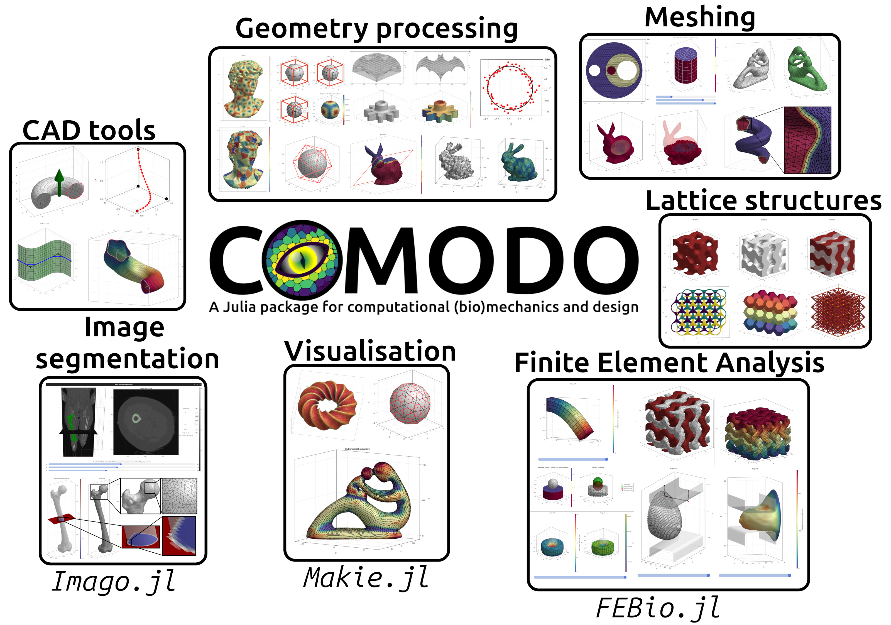

[](https://github.com/COMODO-research/Comodo.jl/blob/main/LICENSE) [](https://github.com/COMODO-research/Comodo.jl/blob/main/.github/workflows/test.yml) [](https://comodo-research.github.io/Comodo.jl/dev/) [](https://codecov.io/gh/COMODO-research/Comodo.jl) 
 [](https://app.gitter.im/#/room/#comodo:gitter.im?utm_source=badge&utm_medium=badge&utm_campaign=pr-badge&utm_content=badge)

  

# About Comodo
Comodo is a [Julia](https://julialang.org/) package for **computational (bio)mechanics and computational design**, and offers functionality for geometry processing, meshing, finite element analysis, automated design, topology optimisation, and image-based modelling. 



Loosely Comodo could stand for **Com**putational **Mo**delling for **D**esign **O**ptimization. A more philosophical angle would be to say that **DO** is like *-do* in the Japanese art *Judo* (ju=柔=gentle, do=道=way), so in this sense Comodo stands for *"the way of computational modelling"*. Comodo is perhaps best defined by its scope. Comodo aims to be a "one-stop-shop" for researchers in computational (bio)mechanics and computational design. It will feature tools for geometry processing, meshing, automated design / topology optimization, finite element analysis, as well as (e.g. medical) image processing and segmentation. 

Comodo.jl started out as a modern re-implementation in Julia of the MATLAB toolbox [GIBBON](https://github.com/gibbonCode/GIBBON). However, rather than literally porting each functional unit, it instead aims to follow a similar philosophy and cover similar but more advanced core functionality.

# Installation
## Simple installation
The following adds the latest release version to your Julia environment. 
```julia
julia> ]
(@v1.xx) pkg> add Comodo
```
## Installation for testing, viewing examples, and co-development 
If you would like to see all the Comodo files and examples (and perhaps also develop/change some of the functionality and examples), you can use the following to get the latest version of Comodo: 
* Create a folder, e.g. named `dev_Comodo` (a folder to view and develop Comodo in)
* Open a terminal and navigate to this new folder.
* Trigger Julia here by calling `julia`
* From Julia now enter the following to activate 
```julia
julia> ]
(@v1.xx) pkg> activate .
```
This will create and activate a new environment called `dev_Comodo`. 
* Now Comodo can be added "for development" to this environment using: 
```julia
julia> ]
(@dev_Comodo) pkg> dev --local Comodo
```
* Other packages can now be added to this environment as desired, e.g. [FEBio.jl](https://github.com/febiosoftware/FEBio.jl).
* Next if one is working in an editor like VS Code or Codium, one can open the `dev_Comodo` folder there to start using this environment. 

# Getting started
To get started install the package, study the documentation, and test some of the demos provided in the [`examples`](https://github.com/COMODO-research/Comodo.jl/tree/main/examples) folder. If you did a simple `add` based installation you may not see the example files easily on your sytem. However you can download the examples from here as well. If you used the `dev --local` way of "installing" Comodo then the examples are available in the environment you defined. 


# Documentation 
[Functional Documentation](https://comodo-research.github.io/Comodo.jl/dev/)

# Combining with finite element analysis
For finite element analysis users are encouraged to combine the Comodo capabilities with the open source C++ software [FEBio](https://febio.org/), e.g. based on the Julia wrapper [FEBio.jl](https://github.com/febiosoftware/FEBio.jl). In addition, users may want to explore the Julia packages [Gridap.jl](https://github.com/gridap/Gridap.jl) and [Ferrite.jl](https://github.com/Ferrite-FEM/Ferrite.jl).


# Testing 
You can test Comodo by running
```julia
pkg> test Comodo
```
The source for the tests is [`runtests.jl`, found in the `test` folder](https://github.com/COMODO-research/Comodo.jl/blob/main/test/runtests.jl)

# Roadmap
New functionality to add:
- [x] Levelset methods
- [ ] Element (e.g. Hex8, Tet4) based lattice structure creation creating both element and surface geometry. 
- [x] Triply periodic minimal surface lattices
- [ ] Spinodoid surfaces lattices 
- [x] Surface stitching method
- [x] Medical image segmentation  -> [**Imago.jl**](https://github.com/COMODO-research/Imago.jl)
- [x] TetGen functionality
- [x] Abaqus INP file creation -> [**AbaqusTools.jl**](https://github.com/COMODO-research/AbaqusTools.jl)
- [ ] Implement GMSH functionality and file import/export
- [x] Topology optimisation -> [**Jutopia.jl**](https://github.com/COMODO-research/Jutopia.jl)
- [x] Finite Element Analysis
	* [**FEBio.jl**](https://github.com/COMODO-research/FEBio.jl)
	* [**ComodoFerrite.jl**](https://github.com/COMODO-research/ComodoFerrite.jl)

# How to contribute? 
Your help would be greatly appreciated! If you can contribute please do so by posting a pull-request. We are very much open to fully acknowledging your contributions e.g. by listing you as a contributor properly wherever possible, by welcoming you on board as a long term contributor, or by inviting you to be a co-author on publications featuring Comodo functionality. Comodo.jl only accepts human generated contributions, as such content created using LLM's or other generative "AI" tools is not acceptable. 

To start contributing follow these steps: 
1. Fork this repository
2. Copy the git URL (e.g. the SSH link) to your forked repository, we'll refer to it here as `<your repo URL>`
3. Now we'll work to create an environment to work in. Create a folder on your machine e.g. `COMODO_dev`, the folder name will also be the environment name later. 
4. Next start julia from this folder (on Ubuntu simple open folder in termal or `cd` there and run `julia`) and run the following to trigger the creation and activation of a Julia environment matching the folder name e.g. `COMODO_dev`:
```julia
] activate .
```
5. Now run the following to add Comodo as a package to develop:
```julia
] dev --local <your repo URL>
```
6. Now open VSCode/VSCodium or your equivalent IDE and open the environment folder. You are now ready to start developing.
7. Functionality should be added in the form of functions in `functions.jl` , found in [the `src` folder](https://github.com/COMODO-research/Comodo.jl/blob/main/src/functions.jl). Please aim to match the style, degree of commenting, and documentation.
8. Please add testing for added functions in `runtests.jl`, found in [the `test` folder](https://github.com/COMODO-research/Comodo.jl/blob/main/test/runtests.jl).
9. Ensure documentation for the added functions is listed in the documentation e.g.  in `functions.md`, found in [the `docs/src` folder](https://github.com/COMODO-research/Comodo.jl/blob/main/docs/src/functions.md).
10. Once tests are passing and documentation has been added you can commit and push your changes and submit a pull request. 

# License 
Comodo.jl is released open source under the [Apache 2.0 license](https://github.com/COMODO-research/Comodo.jl/blob/main/LICENSE). This license covers all source code shared here, including [the examples](https://github.com/COMODO-research/Comodo.jl/blob/main/examples) provided. 
