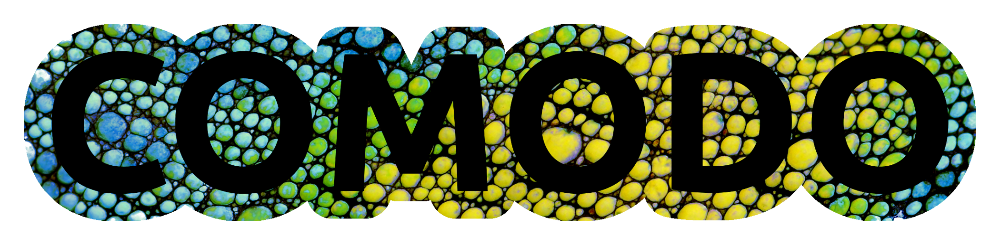

[](https://github.com/COMODO-research/Comodo.jl/blob/main/LICENSE)



# About Comodo
Comodo is a [Julia](https://julialang.org/) package **computational (bio)mechanics and computational design**, and offers functionality for geometry processing, meshing, finite element analysis, automated design, topology optimisation, and image-based modelling. 

Loosely Comodo could stand for **Com**putational **Mo**delling for **D**esign **O**ptimization. A more philosophical angle would be to say that **DO** is like *-do* in the Japanese art *Judo* (ju=柔=gentle, do=道=way), so in this sense Comodo stands for *"the way of computational modelling"*. Comodo is perhaps best defined by its scope. Comodo aims to be a "one-stop-shop" for researchers in computational (bio)mechanics and computational design. It will feature tools for geometry processing, meshing, automated design / topology optimization, finite element analysis, as well as (e.g. medical) image processing and segmentation. For finite element analysis this project currently features the use of the open source C++ solver FEBio. In the future the use of the Julia packages Gridap.jl and Ferrite.jl for finite element analysis will be explored. 

Comodo.jl started out as a modern re-implementation in Julia of the MATLAB toolbox [GIBBON](https://github.com/gibbonCode/GIBBON). However, rather than literally porting each functional unit, it instead aims to follow a similar philosophy and cover similar but more advanced core functionaly.

## Installation
```julia
pkg> add https://github.com/COMODO-research/Comodo.jl
```
# Getting started
The `examples` folder contains examples on the use of Comodo's functionality. 

# Documentation 
Under construction

## Using FEBio
To use Comodo with FEBio one needs to install this external library. You can obtain an official binary from [their website](https://febio.org/) or compile [their source available on GitHub](https://github.com/febiosoftware/FEBio). 
The Comodo `examples` folder contains FEBio demo's, for instance [`demo_febio_0001_cube_uniaxial_hyperelastic.jl`](https://github.com/COMODO-research/Comodo.jl/blob/main/examples/demo_febio_0001_cube_uniaxial_hyperelastic.jl) which features a demonstration for uniaxial loading of a hyperelastic solid cube. 
For now users need to tell Comodo specifically where the FEBio executable is on your system, which means one needs to add the equivalent of following to the top of codes featuring the FEBio functionality: 
```
const FEBIO_PATH = "/home/kevin/FEBioStudio/bin/febio4"
```

 

# Testing 
Under construction

# Roadmap
A detailed roadmap is under construction. 

# How to contribute? 
Your help would be greatly appreciated! If you can contribute please do so by posting a pull-request. I am very much open to fully acknowledging your contributions e.g. by listing you as a contributor properly whereever possible, by welcoming you on board as a long term contributor, or by inviting you to be a co-author on publications featuring Comodo functionality. 

# License 
Comodo.jl is released open source under the [Apache 2.0 license](https://github.com/COMODO-research/Comodo.jl/blob/main/LICENSE).
